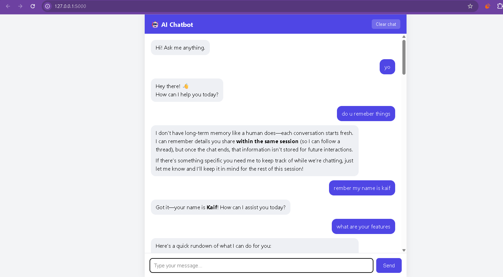
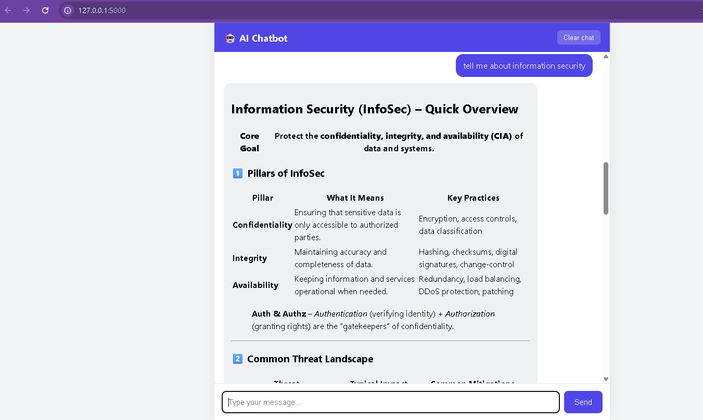
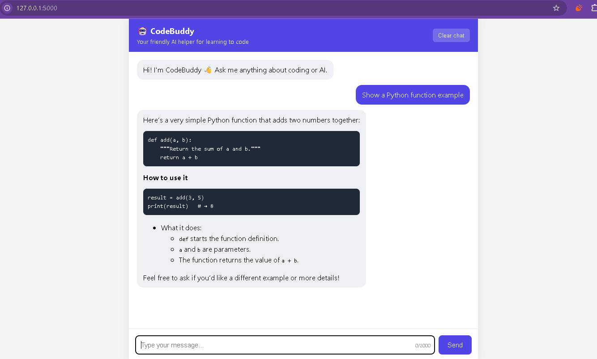

# CodeBuddy - AI Chatbot

## What I built
A web chatbot called **CodeBuddy**, a friendly AI assistant that helps beginners learn coding and AI. The user types a message, the Flask server sends it to an AI model through an API, and the reply is shown in the chat as formatted Markdown.

It started as a basic end-to-end chatbot (Day 1) and was then improved in two steps:

| Day | What was added |
|-----|----------------|
| Day 1 | Working end-to-end chatbot, conversation history, loading state, basic error handling, Markdown replies, `.env` for secrets |
| Day 2 | A structured **system prompt** (role, style, rules), cleaner UI, clearer API integration, better error messages |
| Day 3 | **Input validation**, **specific error handling**, **history trimming**, **clear chat**, **chat saved in the browser**, suggestion buttons, character counter, **rate limiting**, **logging**, `/health` endpoint, **automatic tests** |

## Technology used
- **Python 3** and **Flask** (backend)
- **OpenAI Python SDK** (works with OpenAI, Groq, Gemini and other OpenAI-compatible APIs through `BASE_URL`)
- **HTML, CSS and JavaScript** (frontend, no framework)
- `marked` and `DOMPurify` (safe Markdown rendering)
- `python-dotenv` (loads secrets from `.env`)
- `pytest` (tests)

## Architecture

```
 Browser (index.html)                Flask server (app.py)                 AI API
 --------------------                ---------------------                 ------
 user types a message
 keeps the chat history  --POST /chat-->  1. check the API key exists
                                          2. rate limit per IP
                                          3. validate + trim history
                                          4. add the system prompt
                                          5. call the AI (timeout, retries) --->  model
 shows the reply as      <--JSON reply--  6. return reply or a clear error <---  answer
 Markdown
```

How a request flows:
1. The browser sends the **whole conversation** to `POST /chat` as JSON.
2. The server checks the API key, applies a **rate limit**, and **validates** the messages (right roles, not empty, not too long).
3. The history is **trimmed** to the newest 20 messages and 12,000 characters so requests stay small and cheap.
4. The server puts the **system prompt** first and calls the AI with a 30 second timeout and 2 automatic retries.
5. The reply goes back as JSON. If something fails, the server returns a clear error message that the UI shows in red.

The server is **stateless**: it does not store conversations. The browser keeps the history (and saves it in `localStorage`, so it survives a page refresh) and sends it again with every request, because the AI model itself does not remember anything between calls.

## API integration approach
- The API key lives only on the server in `.env`, which is ignored by Git. It never reaches the browser or GitHub.
- The OpenAI SDK is used with a configurable `base_url`, so switching provider only needs a change in `.env` (`API_KEY`, `BASE_URL`, `MODEL`).
- Errors from the AI service are mapped to friendly messages: wrong key, rate limit or quota, timeout, no connection, and a safe fallback for anything unexpected (details go to the server log, not to the user).

## System prompt
The prompt has three parts: **Role** (CodeBuddy, a helper for beginner programmers), **Style** (clear, concise, Markdown, examples) and **Rules** (admit uncertainty, ask when unclear, decline harmful requests, never handle secrets). It is in `app.py` as `DEFAULT_SYSTEM_PROMPT` and can be replaced with `SYSTEM_PROMPT` in `.env`.

## How to run
```bash
# 1. Clone the repo
git clone https://github.com/kaifaliabbasii/ai-chatbot.git
cd ai-chatbot

# 2. Create and activate a virtual environment
python -m venv venv
venv\Scripts\activate           # Mac/Linux: source venv/bin/activate

# 3. Install dependencies
pip install -r requirements.txt

# 4. Add your API key
copy .env.example .env          # Mac/Linux: cp .env.example .env
# open .env and put your key in API_KEY (and set BASE_URL / MODEL for your provider)

# 5. Start the app
python app.py
```
Open http://127.0.0.1:5000 in your browser.

On Windows PowerShell, if activating the virtual environment is blocked, run `Set-ExecutionPolicy -Scope Process -ExecutionPolicy Bypass` first.

## Run the tests
The tests use a fake AI, so they need no API key and no internet.
```bash
pip install -r requirements-dev.txt
pytest
```
They check the home page, the health check, a normal reply, the system prompt being sent first, empty and too-long messages, history trimming, a missing API key, the rate limit and unexpected AI errors.

## Configuration (in `.env`)
| Setting | Default | Meaning |
|---------|---------|---------|
| `API_KEY` | none | Your AI provider key (required) |
| `BASE_URL` | OpenAI | API address of the provider |
| `MODEL` | `gpt-4o-mini` | Model name |
| `MAX_HISTORY` | 20 | Max messages sent to the AI |
| `MAX_HISTORY_CHARS` | 12000 | Max total characters sent |
| `MAX_MESSAGE_CHARS` | 2000 | Max length of one message |
| `RATE_LIMIT_PER_MIN` | 20 | Requests per IP per minute |
| `REQUEST_TIMEOUT` | 30 | Seconds to wait for the AI |
| `FLASK_DEBUG` | 0 | Set to 1 only while developing |

## Project structure
```
app.py                 Flask server and all backend logic
templates/index.html   Chat page (HTML, CSS, JavaScript)
tests/test_app.py      Automatic tests
requirements.txt       Libraries needed to run
requirements-dev.txt   Libraries needed to run the tests
.env.example           Safe template for settings (no real key)
.gitignore             Keeps .env and other private files out of Git
```

## Problems and solutions
| Problem | Solution |
|---------|----------|
| PowerShell blocked `venv\Scripts\activate` ("running scripts is disabled") | Allowed scripts for the current window only with `Set-ExecutionPolicy -Scope Process -ExecutionPolicy Bypass` |
| `pip install -r requirements.txt` said the file was not found | The ZIP had been extracted into a folder inside a folder. I used `dir` to check and moved into the folder that contains the files |
| GitHub **push protection** blocked my push because a real API key was inside `.env.example` and extra `.env.txt` copies | Removed the key from those files, deleted the copies, created a new key, rebuilt the Git history and made `.gitignore` stricter (`.env`, `.env.*`, `*.env.txt`, except `.env.example`) |
| Screenshots did not appear in the README | The image names had spaces and the README was saved after the push. I renamed the files, saved the README, then committed and pushed again |
| The AI forgot earlier messages | AI models are stateless, so the browser sends the whole history with every request |
| Long chats would make requests slow and expensive | The server trims the history by message count and by total characters |
| A failed request left a stuck message in the chat | On error the message is removed, the text is put back in the input box and a clear error is shown |

## What I learned
- How a browser, a backend and an AI API work together end to end
- Why API keys must stay on the server and out of Git, and how push protection helps catch mistakes
- That chat models have no memory, so "memory" means sending the history again
- How a system prompt shapes the behaviour of the model
- Why a production-minded backend needs validation, timeouts, rate limits, logging and useful error messages
- How to test code with a fake AI so tests are fast, free and repeatable

## What I would improve next
- Stream the answer word by word instead of waiting for the full reply
- Store conversations in a database with user accounts
- Count tokens instead of characters when trimming history
- Use a shared rate limiter (for example Redis) so it works with several servers
- Add voice input and voice output
- Deploy it online with a production server and HTTPS

## Screenshots


